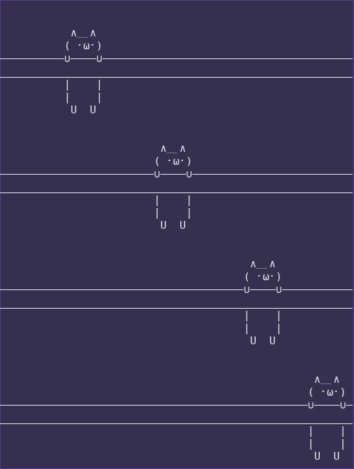

# Bash Cat With Cat
The classic cat command but with a cat. Perfect as an alias.  
The delimiters adapt to your terminal size.  

You can modify the drawing and its position too. Check the code comments.
 

