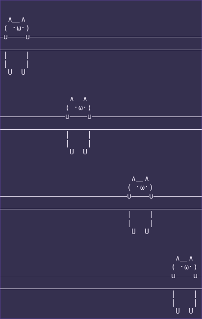

# Bash Cat With Cat
The classic cat command but with a cat. Perfect as an alias. It fallbacks to the original cat if the command is used with pipes.
The delimiters adapt to your terminal size.  

You can modify the drawing and its position too. Check the code comments.
 

