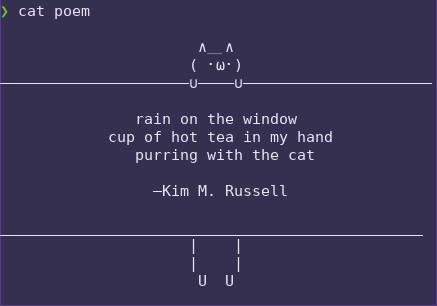

# Bash Cat With Cat
The classic cat command but with a cat. Perfect as an alias. It fallbacks to the original cat if the command is used with pipes.
The delimiters adapt to your terminal size.  
  
Take a look [here](https://github.com/GuidoFe/FortuneCat) if you would like to have a cat cowsay to display quotes in your terminal.

You can modify the drawing and its position too. Check the code comments.
 

